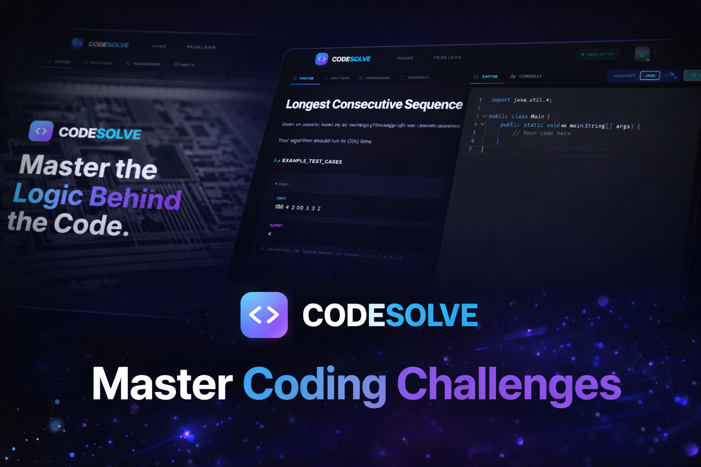

# CODESOLVE, A leetcode like code solving and practicing platform.

# 🌐 Live Preview
https://leetcode-frontend-nine.vercel.app/



---

# How to use in localhost

First create `.env` for both **frontend** and **backend**

---

## Backend `.env`

```env
PORT=3000
DB_CONNECT_STRING=xxx
JWT_KEY=xxx
REDIS_PASS=xxx
JUDGE0_KEY=xxx
GEMINI_KEY=xxx
CLOUDINARY_CLOUD_NAME=xxx
CLOUDINARY_API_KEY=xxx
CLOUDINARY_API_SECRET=xxx
GMAIL_PASS=xxx
GMAIL_USER=xxx
REDIS_PASSWORD=xxx
REDIS_HOST=xxx
REDIS_PORT=xxx
  ```
Where to get

DB_CONNECT_STRING
https://www.mongodb.com/products/platform/atlas-database

JWT_KEY
https://jwtsecrets.com/#generator

REDIS_PASS, REDIS_PASSWORD, REDIS_HOST, REDIS_PORT
https://redis.io/

JUDGE0_KEY
https://judge0.com/

GEMINI_KEY
https://aistudio.google.com/api-keys

CLOUDINARY_CLOUD_NAME, CLOUDINARY_API_KEY, CLOUDINARY_API_SECRET
https://cloudinary.com/

GMAIL_PASS, GMAIL_USER
from Gmail
## Frontend `.env`

```env
VITE_PROJECT_ADMIN=xxx

VITE_FIREBASE_API_KEY=xxx
VITE_FIREBASE_AUTH_DOMAIN=xxx
VITE_FIREBASE_PROJECT_ID=xxx
VITE_FIREBASE_STORAGE_BUCKET=xxx
VITE_FIREBASE_MESSAGING_SENDER_ID=xxx
VITE_FIREBASE_APP_ID=xxx
```
Where to get

VITE_PROJECT_ADMIN
your email for admin access

VITE_FIREBASE_API_KEY, VITE_FIREBASE_AUTH_DOMAIN, VITE_FIREBASE_PROJECT_ID,
VITE_FIREBASE_STORAGE_BUCKET, VITE_FIREBASE_MESSAGING_SENDER_ID,
VITE_FIREBASE_APP_ID
https://console.firebase.google.com/

For localhost run
Install dependencies in both backend and frontend
```npm 
npm install
```

Run both servers at the same time
```npm
npm run dev

```
